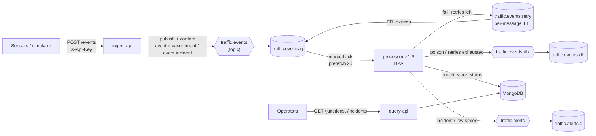

# traffic-events-k8s

Three small .NET 10 microservices that ingest, process and serve **simulated road-sensor traffic events**
(vehicle counts, average speeds, incidents at junctions). They talk over REST and **RabbitMQ**, store data in
**MongoDB**, run on **Kubernetes** (kind) and are built, tested and deployed by a **Jenkins** pipeline.

The point of the project is the operational shape, more than the domain: probes, resource limits, autoscaling,
rolling updates, manual acks, retries, a dead-letter queue, an idempotent consumer, and tests for each.



| Service      | Kind                                              | Responsibility                                                                               |
|--------------|---------------------------------------------------|----------------------------------------------------------------------------------------------|
| `ingest-api` | ASP.NET Core minimal API                          | Validate events (single or batch ≤ 100), publish with publisher confirms. `202` or `503`, never a silent drop. |
| `processor`  | `BackgroundService` (in a minimal host for probes/metrics) | Consume, de-duplicate, enrich, store, update junction status, raise alerts; retry and dead-letter. |
| `query-api`  | ASP.NET Core minimal API                          | Latest junction status, recent incidents, average speed over the last N minutes.            |
| `simulator`  | Console app (also runs as a Kubernetes Job)       | Realistic traffic with duplicates, malformed events and poison messages.                    |

## Quick start

Needs Docker (Desktop), `kind`, `kubectl` and the .NET 10 SDK. `make tools` checks them.

```bash
make cluster-up   # kind cluster + metrics-server; generates k8s/overlays/dev/secrets.env (git-ignored)
make deploy       # build images, load them into kind, kubectl apply -k, wait for rollouts
make demo         # send traffic; show status, incidents, alerts and the DLQ
make smoke        # end-to-end test against the cluster
```

| URL                      | What                                                       |
|--------------------------|------------------------------------------------------------|
| http://localhost:30080   | ingest-api (`POST /events`, header `X-Api-Key`)            |
| http://localhost:30081   | query-api                                                  |
| http://localhost:15672   | RabbitMQ management UI (credentials in `secrets.env`)      |

The other targets: `make test` (unit + integration), `make load` (HPA demo), `make rollout-demo`, `make queues`,
`make status`, `make logs`, `make jenkins-up`, `make cluster-down`. Run `make help` for the full list.

```bash
KEY=$(grep INGEST_API_KEY k8s/overlays/dev/secrets.env | cut -d= -f2)
curl -X POST localhost:30080/events -H "X-Api-Key: $KEY" -H 'Content-Type: application/json' -d '{
  "eventId": "6f1c8a0e-4d1b-4b8e-9f6a-2c7d5e8b9a10", "sensorId": "S-104", "junctionId": "J-17",
  "type": "measurement", "timestamp": "'$(date -u +%FT%TZ)'", "vehicleCount": 42, "avgSpeedKmh": 31.5 }'
curl localhost:30081/junctions/J-17/status
curl "localhost:30081/junctions/J-17/speed?minutes=15"
curl "localhost:30081/incidents?since=2026-10-01T00:00:00Z"
```

## Kubernetes walkthrough

Everything is plain YAML plus Kustomize: `k8s/base` holds the real manifests, and `k8s/overlays/dev` adapts them
to the laptop. [`k8s/base/ingest-api.yaml`](k8s/base/ingest-api.yaml) is commented line by line, and the other
services follow the same pattern.

```
k8s/
  kind-config.yaml        1 node; NodePorts 30080/30081/31672 mapped to localhost (no port-forward needed)
  base/
    kustomization.yaml    namespace, common labels, resource list
    app-config.yaml       ConfigMap: non-secret settings as env vars (Section__Key → Section:Key)
    rabbitmq.yaml         StatefulSet + PVC, ConfigMap (rabbitmq.conf, plugins), Service
    mongodb.yaml          StatefulSet + PVC, Service
    ingest-api.yaml       Deployment, Service, PodDisruptionBudget
    processor.yaml        Deployment, Service (metrics), HorizontalPodAutoscaler
    query-api.yaml        Deployment, Service, PodDisruptionBudget
  overlays/dev/
    kustomization.yaml    Secret generator (from secrets.env), NodePort patch, 1 replica per API, image tags
```

**Deployments and Services.** Each app is a Deployment, which owns ReplicaSets, which own Pods. The Service selects
pods by label and load-balances across the *Ready* ones. Selectors are immutable, so the common
`app.kubernetes.io/part-of` label is applied with `includeSelectors: false`.

**Probes.** Three probes, each answering a different question:

| Probe     | Endpoint        | Question                                    | On failure                    |
|-----------|-----------------|---------------------------------------------|-------------------------------|
| startup   | `/health/live`  | Has it finished booting? (up to 60 s)       | Keep waiting, then restart    |
| liveness  | `/health/live`  | Is the process wedged?                      | **Restart** the container     |
| readiness | `/health/ready` | Should it get traffic or work right now?    | **Remove from Service**, no restart |

Liveness runs *no* dependency checks on purpose. If it checked RabbitMQ, a broker outage would make Kubernetes
restart every pod, which fixes nothing and adds a thundering herd on recovery. Readiness does check dependencies:
`ingest-api` needs RabbitMQ, `query-api` needs MongoDB, and `processor` is ready only when it is connected to
both *and* actively consuming.

The infrastructure pods use **TCP probes**. An exec probe on MongoDB would start `mongosh` (a Node.js process of
about 100 MB) every few seconds in a 512 Mi container. On RabbitMQ, `rabbitmq-diagnostics ping` boots an Erlang VM
per probe. Both have a generous **startupProbe**, which matters; see [Failure modes](#failure-modes-tested).

**Resources.** Every container has requests (what the scheduler reserves, and the 100 % baseline for HPA CPU
percentages) and limits (CPU over the limit is throttled; memory over the limit gets the container OOM-killed).

| Container  | CPU req / limit | Memory req / limit | Notes |
|------------|-----------------|--------------------|-------|
| ingest-api, query-api | 50m / 500m | 128Mi / 256Mi | workstation GC (`DOTNET_gcServer=0`) |
| processor  | 100m / 500m     | 128Mi / 256Mi      | HPA target 60 % of 100m |
| rabbitmq   | 100m / 1        | 256Mi / 512Mi      | `vm_memory_high_watermark.relative = 0.6` blocks publishers before the OOM killer acts |
| mongodb    | 100m / 1        | 256Mi / 512Mi      | `--wiredTigerCacheSizeGB 0.25`; by default the cache sizes itself from RAM it can see |

**ConfigMap and Secret.** Non-secret settings come from `app-config` via `envFrom`. Credentials come from the
Secret, and connection URIs are assembled in the pod spec with `$(VAR)` expansion, so hosts live in config and
only credentials are secret:

```yaml
- name: RabbitMq__Uri
  value: amqp://$(RABBITMQ_USER):$(RABBITMQ_PASSWORD)@$(RABBITMQ_HOST):5672/
```

The Secret is generated by Kustomize from a git-ignored `secrets.env` (`make secrets` fills it with random values).
The generator appends a content hash to the Secret's name and rewrites every reference. So changing a secret
changes the pod template, which triggers a rolling restart, and stale credentials can't linger. (Gotcha: the
overlay must set the same `namespace` as the base, or the references aren't rewritten.)

**Rolling updates.** `maxSurge: 1, maxUnavailable: 0`: Kubernetes starts a new pod, waits for it to become *Ready*,
and only then terminates an old one. On termination the pod is removed from Service endpoints *asynchronously*,
so a `preStop` sleep of 5 s keeps it serving requests that were already routed to it. `revisionHistoryLimit: 5`
is how far back `kubectl rollout undo` can go. `make rollout-demo` polls query-api through a rollout and a
rollback and counts failed requests.

**Graceful shutdown.** SIGTERM → preStop sleep → the host stops. The processor cancels its consumer, lets the
in-flight message finish and be acked, and closes its channel, so prefetched messages that never started go
back to the queue. `HostOptions.ShutdownTimeout` is 25 s, inside `terminationGracePeriodSeconds: 30`. After
that it's SIGKILL, and anything unacked is redelivered (see idempotency).

**HorizontalPodAutoscaler.** `processor` scales 1 → 3 on CPU (60 % of the 100m request) using `autoscaling/v2`.
The Deployment has **no `replicas:` field**: if it did, every `kubectl apply` would reset the count and fight the
HPA. Scale-down stabilization is 60 s (the default is 300 s) so the demo also shows scale-in. More pods means more
competing consumers on one queue, and prefetch (20) keeps one pod from hoarding messages. The HPA needs
metrics-server; on kind it runs with `--kubelet-insecure-tls`, because kind's kubelets use self-signed serving
certs (managed clusters don't need this).

**PodDisruptionBudgets** keep one API pod available during voluntary disruptions (node drain, upgrade).
**Security context**: non-root (chiseled images run as UID 1654), read-only root filesystem with an `emptyDir`
for `/tmp`, all capabilities dropped, no privilege escalation, `RuntimeDefault` seccomp.

**StatefulSets** for RabbitMQ and MongoDB give a stable identity (`rabbitmq-0`) and a PersistentVolumeClaim per
pod that survives rescheduling. RabbitMQ's data directory is tied to its node name, so the stable name matters.

## RabbitMQ design

The topology is declared in one place ([`Topology.cs`](src/TrafficEvents.Infrastructure/Messaging/Topology.cs)).
Declarations are idempotent and every service declares the topology on connect, so start-up order doesn't matter.

| Name                    | Type            | Purpose |
|-------------------------|-----------------|---------|
| `traffic.events`        | topic exchange  | Routing key `event.<type>`, so consumers can bind to just incidents later |
| `traffic.events.q`      | durable queue   | Work queue for the processor. `x-dead-letter-exchange` = DLX as a safety net |
| `traffic.events.retry`  | durable queue   | No consumer. Each message carries a per-message TTL (the retry delay); on expiry the broker dead-letters it back to `traffic.events.q` |
| `traffic.events.dlx`    | fanout exchange | Dead-letter exchange |
| `traffic.events.dlq`    | durable queue   | Poison messages, with `error`, `error-type`, `retry-count`, `failed-at` headers |
| `traffic.alerts`        | topic exchange  | `alert.incident`, `alert.low_speed` |
| `traffic.alerts.q`      | durable queue   | Alerts for inspection; `x-max-length` 10 000, drop-head |

**Publishing** (ingest-api, processor alerts). Messages are persistent, published with `mandatory: true` and
**publisher confirms**. `POST /events` returns `202` only after the broker has confirmed every event in the batch;
confirms are awaited together, so it's one round trip per batch. A nack, an unroutable message, a dead connection,
or no confirm within 5 s all become `503`. The sensor retries, and since events carry their own ID, retrying is safe.

**Consuming** (processor). Manual acks with prefetch 20. For each delivery, exactly one of these happens, and only
after the handler finishes:

| Outcome | Action |
|---------|--------|
| Processed, or a duplicate | `ack` |
| Transient failure (e.g. MongoDB timeout), retries left | publish a copy to `traffic.events.retry` with `retry-count + 1` and a 5 s TTL (confirmed), **then** `ack` the original |
| Retries exhausted (3), or a permanent failure (malformed JSON, invalid event, unknown junction) | publish to the DLX with the error headers (confirmed), **then** `ack` |
| The process dies before acking | the broker redelivers to another consumer |

Why a retry queue with TTL instead of `nack(requeue: true)`? A requeued message comes straight back, so a broken
message spins in a tight loop and starves the queue. The TTL queue gives a real delay without blocking the
consumer. The delay is a **per-message** TTL, so it can change in config without redeclaring the queue (changing
queue arguments fails with `PRECONDITION_FAILED`). Why publish to the DLX ourselves instead of `nack(requeue:
false)`? So the dead message carries *why* it died; an operator looking at the DLQ needs the reason.
`make queues` shows it.

**Idempotent consumer.** RabbitMQ delivers at least once, and sensors resend. Every write is idempotent on its own,
and a `processed_events` record (keyed by `eventId`) is written **last**:

1. If `processed_events` has the `eventId`, it's a duplicate: ack and skip (the fast path).
2. Insert into `events` with `_id = eventId`. A second insert is a duplicate-key no-op.
3. Update `junction_status` only if this event is newer than the stored one (`lastMeasurementAt < timestamp`).
   Out-of-order and replayed events can't move state backwards.
4. Alert gate: insert `alerts{_id: eventId, published: false}`, publish, set `published: true`. On redelivery a
   published alert is skipped, and an unpublished one (we crashed in between) is published again.
5. Insert `processed_events{_id: eventId}`, then ack.

If the pod is killed anywhere in steps 2–5, the redelivered message re-runs them harmlessly. Alerts are
**at-least-once**, with `AlertId = eventId` so downstream consumers can de-duplicate. Exactly-once publishing
would need a transactional outbox; see trade-offs.

## MongoDB model and indexes

| Collection          | `_id`       | Shape | Indexes |
|---------------------|-------------|-------|---------|
| `junctions`         | `J-17`      | name, district, speedLimitKmh. Reference data, seeded by the processor | `_id` |
| `events`            | `eventId`   | the event plus `junctionName`, `district`, `processedAt` | `{junctionId: 1, timestamp: -1}`, `{type: 1, timestamp: -1}`, **TTL** `{processedAt: 1}` 7 days |
| `junction_status`   | `junctionId`| latest count/speed + `lastMeasurementAt`, `lastIncident` + `lastIncidentAt` | `_id` |
| `processed_events`  | `eventId`   | `processedAt` | `_id` (unique by definition), **TTL** 7 days |
| `alerts`            | `eventId`   | reason, `published` | **TTL** `{raisedAt: 1}` 7 days |

| Query | Served by |
|-------|-----------|
| `GET /junctions/{id}/status` | `junction_status._id` point lookup |
| `GET /junctions/{id}/speed?minutes=15` | aggregation `$match {junctionId, timestamp ≥ now−15m, type}` → `$group`, on `{junctionId: 1, timestamp: -1}` (equality first, then range: the ESR rule) |
| `GET /incidents?since=…` | `{type: 1, timestamp: -1}`: equality on type, range and sort on time |

Indexes are created idempotently by the processor at start-up, since it owns the write model. A test asserts they
exist, and another checks via `explain` that the speed query actually uses its index. The TTL monitor in `mongod`
deletes expired documents about every 60 s. TTL is on `processedAt`, not the sensor's `timestamp`, so a late event
isn't deleted on arrival.

## CI/CD

**Jenkins** ([`Jenkinsfile`](Jenkinsfile)): Checkout → Restore & Build → Unit tests → Integration tests
(Testcontainers) → Build images → Load images into kind → Deploy (`kubectl apply -k`) → Smoke test, then JUnit
reports and a deployment report in `post`. Each build tags images `<commit>-b<build>`. The tag is pinned by a
generated overlay on top of `k8s/overlays/dev`, never by `kubectl set image`, which the next apply would silently
revert.

Run it locally (needs a commit, since Jenkins builds what's committed, and the kind cluster up):

```bash
git branch -M main && git add -A && git commit -m "..."   # if you haven't yet
make jenkins-up                                            # builds ci/jenkins image, ~3-5 min first time
open http://localhost:8081                                 # admin / admin (override: JENKINS_ADMIN_PASSWORD)
# Job "traffic-events-k8s" → Build Now
make jenkins-down
```

[`ci/jenkins`](ci/jenkins) holds everything as code. The **Dockerfile** is the Jenkins LTS image plus the .NET 10
SDK, docker CLI with buildx, kind and kubectl. **casc.yaml** (Configuration as Code) declares the admin user, the
`secrets.env` file credential and the pipeline job: no setup wizard, nothing clicked. The **docker-compose.yml**
mounts the Docker socket, puts Jenkins on the `kind` Docker network (so the pipeline uses
`kind get kubeconfig --internal` and reaches `traffic-events-control-plane:6443` and the NodePorts by name), and
points Testcontainers at `host.docker.internal`. Running the controller as root for socket access is a
local-demo shortcut. A real setup uses agents (Kubernetes pods or VMs) and a registry instead of `kind load`.

**GitHub Actions** ([`.github/workflows/ci.yml`](.github/workflows/ci.yml)): build, unit tests, integration tests
(Docker is available on `ubuntu-latest`), and a matrix job that builds all four images without pushing.

## Tests

```bash
make test-unit         # 48 tests, no Docker
make test-integration  # 21 tests, Testcontainers: rabbitmq:4.1-management + mongo:7 (same as the cluster)
make smoke             # 1 test against the deployed cluster
```

| Test | Proves |
|------|--------|
| `EventValidatorTests` | Bad events are rejected with field-level errors; all errors reported together |
| `IngestEndpointTests` | 401 without/with wrong key; 202 single and batch (one publish per batch); 400 for invalid, malformed, empty, oversized; **503 when the broker is down**; liveness independent of the broker |
| `AlertRuleTests` | Incident → `incident`; below threshold → `low_speed`; at threshold → nothing |
| `Same_event_delivered_twice_is_stored_once` | Idempotent consumer |
| `Poison_message_is_dead_lettered_after_max_retries` | 1 attempt + 3 delayed retries, then DLQ with `retry-count = 3` and the error |
| `Transient_failure_is_retried_then_succeeds…` | Retry path recovers without dead-lettering |
| `Malformed_or_invalid_message_goes_straight_to_the_dlq`, `Unknown_junction…` | Permanent failures skip retries |
| `Low_speed_produces_exactly_one_alert_even_when_redelivered`, `Incident_produces_one_alert…` | Alert rule and alert idempotency |
| `Alert_not_published_before_a_crash_is_published_on_redelivery` | The alert gate doesn't lose alerts |
| `Graceful_shutdown_finishes_the_in_flight_message_and_acks_it` | Drain on SIGTERM |
| `Pod_killed_mid_processing_redelivers…` | Half-done work + redelivery = correct end state |
| `MongoRepositoryTests` | Indexes + TTL exist; speed query uses its index; stale events don't overwrite status; aggregation and incident queries |
| `PublisherTests` | Confirmed publishes are persistent and routed; unreachable broker → `PublishFailedException` |
| `ClusterSmokeTests` | `POST /events` → visible via `query-api` in the real cluster |

## Failure modes tested

| Failure | What happens | Covered by |
|---------|--------------|-----------|
| **Broker down** | `ingest-api` returns `503` (never `202`) and its readiness fails, so Kubernetes stops routing to it. The processor keeps retrying the connection with backoff, and the client's automatic recovery re-declares topology and consumers. | `Broker_unavailable_is_503…`, `Publishing_when_the_broker_is_unreachable…`; in the cluster: `kubectl -n traffic-events scale sts rabbitmq --replicas=0` |
| **MongoDB down** | Handler fails → message retried with delay (3×) → DLQ if still down. Readiness fails on processor and query-api. Driver timeouts are 5 s so this happens quickly. | `Transient_failure_is_retried…`; in the cluster: scale `mongodb` to 0 |
| **Poison message** | Malformed/invalid/unknown junction → DLQ immediately, with the reason in headers. Repeated failures → DLQ after 3 retries. | DLQ tests; `make demo` sends 1 % poison events |
| **Duplicate delivery** | Detected via `processed_events`, acked, counted as `processor_messages_total{outcome="duplicate"}` | `Same_event_delivered_twice…`, alert tests |
| **Pod killed mid-processing** | No ack → broker redelivers → idempotent writes converge. On a graceful stop the in-flight message is finished first. | `Pod_killed_mid_processing…`, `Graceful_shutdown…`; in the cluster: `kubectl delete pod -l app.kubernetes.io/name=processor` under load |
| **Out-of-order events** | Older events don't overwrite newer junction status | `Older_event_does_not_overwrite…` |

Found while bringing the cluster up on an 8 GB laptop: MongoDB's **liveness probe killed its first boot** while
the image's init script was creating the root user. On restart, the entrypoint saw a non-empty data directory and
skipped initialisation, so every client failed with `Authentication failed`. The fix is a `startupProbe` (up to
5 min) that holds liveness off until the port is open. Recovering needs the half-initialised volume deleted:
scale to 0, delete `pvc/data-mongodb-0`, scale to 1.

## Recorded runs

Real output from the kind cluster on an 8 GB MacBook, in [`docs/recordings`](docs/recordings):

- **[HPA](docs/recordings/hpa.txt):** 600 events/s from an in-cluster Job, 108,350 events, all `202`. Processor CPU
  jumped to ~500 % of its request, the HPA went **1 → 3** within one 15 s sample, the queue drained, and it went
  back to **1** about 60 s after the load stopped (the scale-down stabilization window). No restarts, no OOM kills.
- **[Rolling update + rollback](docs/recordings/rollout.txt):** query-api polled every 100 ms throughout:
  `ok=177 failed=0` during the rollout and `ok=67 failed=0` during `kubectl rollout undo`.
- **[Broker down](docs/recordings/broker-down.txt):** `202` → scale RabbitMQ to 0 → `503` for ~10 s → readiness
  fails and the pod leaves the Service (connection refused) → scale back → `202`, and **no pod restarted**.
- **[Demo](docs/recordings/demo.txt):** 1,459 accepted and 31 rejected; duplicates skipped; the DLQ holds
  poison events with `error: Unknown junction 'J-999'`.

## Observability

- **Logs**: Serilog, one JSON object per line on stdout (`kubectl logs`, any log shipper), enriched with `service`
  and `version`. Probe and scrape requests are kept out of the logs.
- **Metrics**: `/metrics` (prometheus-net) on every service. HTTP metrics plus `ingest_events_published_total{type}`,
  `ingest_events_rejected_total{reason}`, `processor_messages_total{outcome}` (processed / duplicate / retried /
  dead_lettered), `processor_message_duration_seconds`, `processor_alerts_published_total{reason}`. Pods carry
  `prometheus.io/*` annotations, and RabbitMQ's own Prometheus endpoint is on 15692.
- **Health**: `/health/live`, `/health/ready`; `GET /` returns service name and version (the image tag).

## Trade-offs

**RabbitMQ vs Kafka.** This workload is a work queue: each event is processed once by one of N competing
consumers, needs per-message acks, retries, a DLQ and routing by type. RabbitMQ does that natively. Kafka is a
replicated log: great for replay, multiple independent consumers of the full stream, very high throughput and
event-sourcing, but per-message retry and DLQ have to be built (retry topics), and parallelism is capped by
partition count. If traffic data had to be replayed into analytics or kept as history, I'd add Kafka (or RabbitMQ
Streams) for that stream and keep a queue for the processing work.

**Classic vs quorum queues.** Classic durable queues on a single node keep the demo simple. On a 3-node cluster
I'd use **quorum queues** (Raft-replicated, survive node loss, with a native delivery limit).

**Kustomize vs Helm.** Kustomize patches plain YAML with no templating language, which suits a single app with
a couple of environments, and it ships inside `kubectl`. Helm earns its place when packaging something for others
to install with many knobs, or for third-party software. I'd use the official Helm charts / operators for RabbitMQ
and MongoDB in production.

**Plain manifests for RabbitMQ and MongoDB.** Bitnami images and charts moved behind a subscription in 2025, and
plain StatefulSets are easy to read line by line. In production: the RabbitMQ Cluster Operator and a MongoDB
replica set via its operator, or managed services.

**Alerts at-least-once, not exactly-once.** A crash between publishing an alert and marking it published causes
one duplicate, which consumers absorb using `AlertId`. Exactly-once would need a transactional outbox (write the
alert in the same MongoDB transaction as the event, and relay it from a separate process), plus a replica set
for transactions.

**One consumer channel, dispatch concurrency 1.** Each pod handles one message at a time, in order, and scales
out by pods (the HPA). It's simple to reason about. Raising `ConsumerDispatchConcurrency` would trade ordering for
per-pod throughput.

**Readiness on RabbitMQ for ingest-api.** When the broker is down, ingest pods leave the Service, so clients get
connection errors rather than `503`. The `503` path covers the seconds before readiness flips and failures during
a request. Either is a "retry later" signal; the alternative (always Ready, always `503`) is also defensible.

**What I'd change for AKS.**
- Images go to Azure Container Registry, with AKS pulling via managed identity (no `kind load`).
- Secrets live in Key Vault, mounted with the Secrets Store CSI driver, instead of a generated Secret.
- An Ingress controller (or Application Gateway for Containers) with TLS replaces NodePorts.
- RabbitMQ and MongoDB run as a 3-node RabbitMQ cluster with quorum queues and a MongoDB replica set (or Cosmos DB for MongoDB / Atlas), on Azure Disk volumes and zone-redundant.
- Multiple nodes across zones, pod anti-affinity / topology spread constraints, and a PDB per stateful service.
- Azure Monitor managed Prometheus + Grafana, with alerts on DLQ depth and consumer lag.
- The HPA scales on queue depth via KEDA's RabbitMQ scaler: CPU is a proxy, and backlog is the real signal.
- CD by GitOps (Flux/Argo CD), with Jenkins building and pushing images.

## Repository layout

```
src/
  TrafficEvents.Core            event model, validation, alert rule (no I/O)
  TrafficEvents.Infrastructure  RabbitMQ topology/connection/publisher, MongoDB schema, health, logging, metrics
  TrafficEvents.IngestApi       POST /events
  TrafficEvents.Processor       consumer, handler, store, alerts
  TrafficEvents.QueryApi        read endpoints
  TrafficEvents.Simulator       traffic generator
tests/  Unit, Integration (Testcontainers), Smoke (cluster)
k8s/    kind config, Kustomize base + dev overlay
ci/jenkins/  Jenkins image, configuration-as-code, docker-compose
scripts/     what the Makefile runs
docs/demo.md  a 5-minute live demo script
```

## Licence

MIT.
